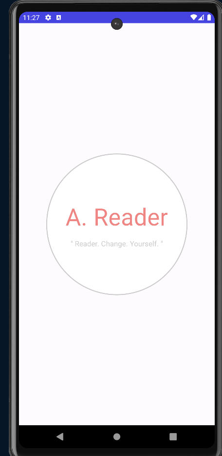

# :zap: Weather App
<!-- 

<a href="https://automated-solution-comparison-and-testing-framework.streamlit.app/" target="_blank">Visit Site</a>

 -->

1. Developed a mobile application using Kotlin-Jetpack Compose that enables users to log in and access books from the Google Books API.
2. Implemented features including a home screen displaying last read and favorited books, as well as a search screen for discovering and reading book descriptions, including categories, publish dates, and authors. Leveraged Firebase for user authentication,which to allow users to log in, to store and retrieve data like Records the books a user is currently reading , Manages a list of favorited books. Hilt for dependency injection, Retrofit for API communication, Coil for image loading, and Jetpack Compose for building the user interface
3. Technologies used - Firebase, Hilt, Retrofit, Coil, Jetpack Compose (Kotlin)

## Improvements :
1. If someone put wrong login details, app was crashing :  Fixed
2. Due to TypeMismatch , app was crashing. like Int or Double : Fixed
3. Data or Classed made by "Json to Kotlin class" plugin was not very accurate, due to which app was crashing. I choose better class/data class structure so that app does not crash : Fixed
4. Proper use of Firebase database as if it is realtime database : Fixed
5. If login credentails are wrong, then show a Toast message to indicate that so. : Fixed
6. If during Create Account, wrong details were entered, then show warning. : Not Fixed
7. Bring data of perticular user only. In app, whole data was brought ,then according to user, data was filtered, this may lead to security issues : Not Fixed

<!-- ## Components :
1. Incorrect Solution (incorrect_solution.cpp):
    This file contains the cpp code you have written which is giving wrong output to some input.
2. Correct Solution (correct_solution.cpp):
    This file contains the correct cpp code
3. Test Case Generator (test_case_generator.cpp):
    This file is used to generate random test cases which is used as input to both above file.
4. Checker Script (checker.sh): 
    This file contains the code which is used to run above files and store results of above files in seperate txt file which is used as the input and output accordingly -->

 ## :camera: Screen Shots of App :

    

    

    

    

    

<!-- ## :camera: Screenshots -->

